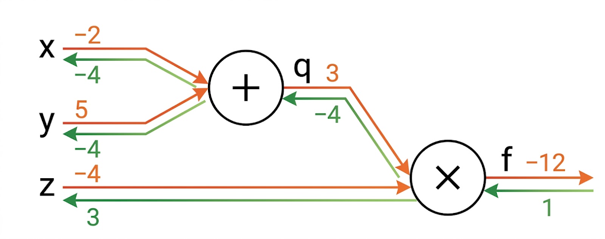
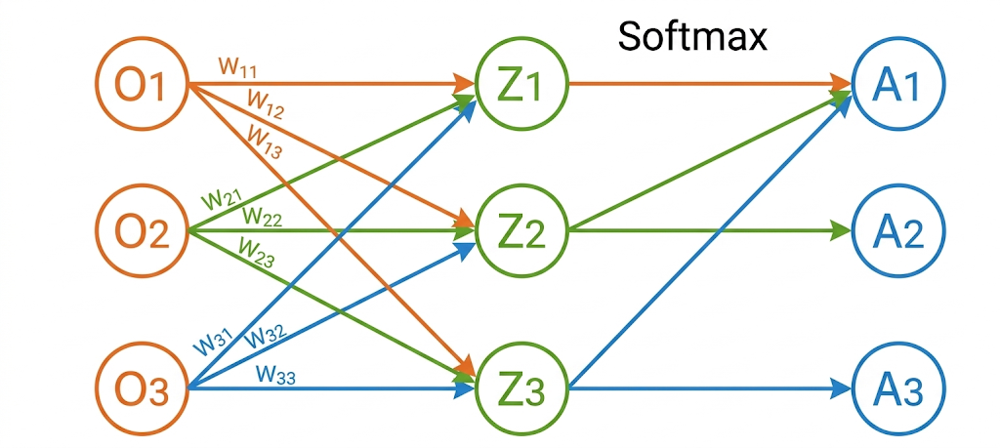

# 1  感知机的数学推导

$f_{c1} = w_0^{c1}x_0 + w_1^{c1}x_1 + b^{c1}$

$f_{c2} = w_0^{c2}x_0 + w_1^{c2}x_1 + b^{c2}$ 

$$
\begin{aligned}
f_{\text{out}} & = w_0^{\text{out}}f_{c1} + w_1^{\text{out}}f_{c2} + b^{\text{out}}\\
& = (w_0^{\text{out}}w_0^{c1} + w_0^{\text{out}}w_0^{c2})x_0 + (w_1^{\text{out}}w_1^{c1} + w_1^{\text{out}}w_1^{c2})x_2 + w_0^{\text{out}}b^{c1} + w_1^{\text{out}}b^{c2} + b^{\text{out}} \\
\end{aligned}
$$

令：

$k_0 = w_0^{\text{out}}w_0^{c1} + w_0^{\text{out}}w_0^{c2}$

$k_1 = w_1^{\text{out}}w_1^{c1} + w_1^{\text{out}}w_1^{c2}$

$c = w_0^{\text{out}}b^{c1} + w_1^{\text{out}}b^{c2} + b^{\text{out}}$

最后化简为:

$f_\text{out} = k_0x_0 + k_1x_1 + c$

 

# 2  梯度下降算法

$\begin{aligned}  
\Delta W = -\eta \nabla E(W^{\text{old}})  
\end{aligned} \ \ \Rightarrow \ \ \begin{aligned}
W_{ij}^{\text{new}} = W_{ij}^{\text{old}} - \eta \left. \frac{\partial E}{\partial W_{ij}} \right|_{W_{ij} = W_{ij}^{\text{old}}}
\end{aligned}$

 

# 3  链式法则推导

链式法则，基于$\begin{aligned}  
f(x) = \frac{1}{1 + e ^ {-(wx + b)}}  
\end{aligned}$

- 其参数为权重 $w$、$b$。我们需要求关于 $w$ 和 $b$ 的偏导，然后应用梯度下降公式就可以更新参数。

- 我们将复合函数分解为一系列的初等函数导数相乘的形式：

| **函数**                 | **导数**                                                 | **导数**                                         |
| ---------------------- | ------------------------------------------------------ | ---------------------------------------------- |
| $h_1 = x \cdot w$      | $\frac{\partial h_1}{\partial w} = x$（对 w 求偏导）         | $\frac{\partial h_1}{\partial x} = w$（对 x 求偏导） |
| $h_2 = h_1 + b$        | $\frac{\partial h_2}{\partial h_1} = 1$（对 h_1 求偏导）     | $\frac{\partial h_2}{\partial b} = 1$（对 b 求偏导） |
| $h_3 = h_2 \cdot (-1)$ | $\frac{\partial h_3}{\partial h_2} = -1$               |                                                |
| $h_4 = e^{h_3}$        | $\frac{\partial h_4}{\partial h_3} = e^{h_3}$          |                                                |
| $h_5 = h_4 + 1$        | $\frac{\partial h_5}{\partial h_4} = 1$                |                                                |
| $h_6 = 1/h_5$          | $\frac{\partial h_6}{\partial h_5} = -\frac{1}{h_5^2}$ |                                                |

- 整个复合函数 $f(x;w,b)$ 关于参数 $w$ 和 $b$ 的导数可以通过 $f(x;w,b)$ 与参数 $w$ 和 $b$ 之间路径上所有的导数连乘来得到，即：

$\begin{aligned}
\frac{\partial f(x; w, b)}{\partial w} &= \frac{\partial f(x; w, b)}{\partial h_6} \frac{\partial h_6}{\partial h_5} \frac{\partial h_5}{\partial h_4} \frac{\partial h_4}{\partial h_3} \frac{\partial h_3}{\partial h_2} \frac{\partial h_2}{\partial h_1} \frac{\partial h_1}{\partial w}, \\
\frac{\partial f(x; w, b)}{\partial b} &= \frac{\partial f(x; w, b)}{\partial h_6} \frac{\partial h_6}{\partial h_5} \frac{\partial h_5}{\partial h_4} \frac{\partial h_4}{\partial h_3} \frac{\partial h_3}{\partial h_2} \frac{\partial h_2}{\partial b}.
\end{aligned}$

以 $w$ 为例，当 $x = 1$, $w = 0$, $b = 0$ 时，可以得到：

$\begin{aligned}
\left. \frac{\partial f(x; w, b)}{\partial w} \right|_{x=1, w=0, b=0} &= \frac{\partial f(x; w, b)}{\partial h_6} \frac{\partial h_6}{\partial h_5} \frac{\partial h_5}{\partial h_4} \frac{\partial h_4}{\partial h_3} \frac{\partial h_3}{\partial h_2} \frac{\partial h_2}{\partial h_1} \frac{\partial h_1}{\partial w} \\
&= 1\cdot (-\frac{1}{2^2}) \cdot 1 \cdot e^{-1} \cdot (-1) \cdot 1 \cdot x \\
&= 1 \times -0.25 \times 1 \times 1 \times -1 \times 1 \times 1 \\
&= 0.25
\end{aligned};$

- 常用函数导数：

| **函数**                                                                                                                                                                                                                              | **导数**                           |
| ----------------------------------------------------------------------------------------------------------------------------------------------------------------------------------------------------------------------------------- | -------------------------------- |
| $f(a) = a^2$                                                                                                                                                                                                                        | $2a$                             |
| $f(a) = a^3$                                                                                                                                                                                                                        | $3a^2$                           |
| $f(a) = ln(a)$                                                                                                                                                                                                                      | $\frac{1}{a}$                    |
| $f(a) = e^a$                                                                                                                                                                                                                        | $e^a$                            |
| $\sigma(z) = \frac{1}{1 + e^{-z}}$                                                                                                                                                                                                  | $\sigma(z)(1 - \sigma(z))$       |
| $g(z) = tanh(z) = \frac{e^z - e^{-z}}{e^z + e^{-z}}$                                                                                                                                                                                | $1 - (tanh(z))^2 = 1 - (g(z))^2$ |
| 注，sigmoid的导数计算：                                                                                                                                                                                                                     |                                  |
| $\sigma(x) = \frac{1}{1 + e^{-x}} \rightarrow \frac{d\sigma(x)}{dx} = \frac{e^{-x}}{(1 + e^{-x})^2} = \left( \frac{1 + e^{-x} - 1}{1 + e^{-x}} \right) \cdot \left( \frac{1}{1 + e^{-x}} \right) = (1 - \sigma(x)) \cdot \sigma(x)$ |                                  |

 

# 4  前向和反向传播推导示例

- 橙色线方向为正向传播，绿色线方向为反向传播

- 正向传播时，整个网络输出的预测结果为：
  - $f = (x + y) * z = (-2 + 5)*(-4) = -12$
  - 中间变量：$q = x + y = -2 + 5 = 3$
  - 网络输出：$f = q \cdot z = 3 \cdot (-4) = -12$
  - 假设网络输出的目标值结果是 $-11$，那么可以注意到预测值和目标值是不相等的，所以我们需要优化网络使得输出的预测结果趋近目标值结果。 
    - 所以目标值设定为 $f_\text{target} = -11$。引入标准的均方误差损失函数 (MSE) ：
      - $L = \frac{1}{2}(f - f_\text{target})^2$
    - 初始损失值为：
      - $L = \frac{1}{2} \times (-12 - (-11))^2 = \frac{1}{2} \times (-1)^2 = 0.5$
    - 我们希望让差距 $0.5$ 缩小!!!
- 反向传播（链式法则求损失偏导），起点是损失函数对网络输出的梯度：
  - $\frac{\partial L}{\partial f} = f - f_\text{target} = -12 - (-11) = -1$
  - 所以需要计算输出损失值 $L$ 对各变量的偏导。
    - $\frac{\partial L}{\partial z} = \frac{\partial L}{\partial f} \cdot \frac{\partial f}{\partial z} = \frac{\partial L}{\partial f} \cdot q = (-1) \times 3 = -3$
    - $\frac{\partial L}{\partial q} = \frac{\partial L}{\partial f} \cdot \frac{\partial f}{\partial q} = \frac{\partial L}{\partial f} \cdot z = (-1) \times (-4) = 4$
    - $\frac{\partial L}{\partial x} = \frac{\partial L}{\partial f} \cdot \frac{\partial f}{\partial q} \cdot \frac{\partial q}{\partial x} = (-1) \cdot (-4) \cdot \frac{\partial q}{\partial x} = (-1) \times (-4) \times 1 = 4$
    - $\frac{\partial L}{\partial y} = \frac{\partial L}{\partial f} \cdot \frac{\partial f}{\partial q} \cdot \frac{\partial q}{\partial y} = (-1) \cdot (-4) \cdot \frac{\partial q}{\partial y} = (-1) \times (-4) \times 1 = 4$
  - 学习率设定为 $\eta = 0.01$，手动进行反向传播应用标准梯度下降公式$w_\text{new} = w_\text{old} - \eta \cdot \frac{\partial L}{\partial w}$
    - $z_\text{new} = z_\text{old} - \eta \cdot \frac{\partial L}{\partial z} = -4 - 0.01 \times (-3) = -3.97$
    - $x_\text{new} = x_\text{old} - \eta \cdot \frac{\partial L}{\partial x} = -2 - 0.01 \times 4 = -2.04$
    - $y_\text{new} = y_\text{old} - \eta \cdot \frac{\partial L}{\partial y} = 5 - 0.01 \times 4 = 4.96$
  - 重新前向传播验证，代入更新后的参数值计算：
    - $q_\text{new} = x_\text{new} + y_\text{new} = -2.04 + 4.96 = 2.92$
    - $f_\text{new} = q_\text{new} \cdot z_\text{new} = 2.92 \times (-3.97) = -11.5924$
  - 计算更新后的损失值：
      $L_\text{new} = \frac{1}{2}(f_\text{new} - f_\text{target})^2 = \frac{1}{2}(-11.5924 - (-11))^2 \approx 0.1755$
  - 由于 $L_\text{new} = 0.1755 < L_\text{old} = 0.5$ 所以网络的前向传播得到的结果与真实值更近了

 

# 5  softmax 求导过程

- 设输入向量为 $X = (x_1, x_2, \dots, x_n)$，经过 Softmax 激活得到 $Y = (y_1, y_2, \dots, y_n)$，满足：
  
  - $y_i = \frac{e^{x_i}}{\sum_{k=1}^n e^{x_k}} \quad \text{且} \quad \sum_{i=1}^n y_i = 1$

- 分母求和项中仅第 $i$ 项含有自变量 $x_i$，其余项求导为 0：
  
  - $\frac{\partial}{\partial x_i}\left(\sum_{k=1}^n e^{x_k}\right) = e^{x_i}$

- 求导推导过程如下：
  
  1. 当 $i=j$ 时，
   - $\begin{aligned} \frac{\partial y_j}{\partial x_i} &= \frac{\partial y_i}{\partial x_i} \\ &= \frac{\partial}{\partial x_i}\left(\frac{e^{x_i}}{\sum_{k=1}^n e^{x_k}}\right) \\ &= \frac{\partial}{\partial x_i}\left(e^{x_i}\right) \cdot \frac{1}{(\sum_{k=1}^n e^{x_k})} + e^{x_i} \cdot \frac{\partial}{\partial x_i}\left( \frac{1}{\sum_{k=1}^n e^{x_k}}\right) \\ &= \frac{e^{x_i} \cdot (\sum_{k=1}^n e^{x_k}) - e^{x_i} \cdot e^{x_i}}{(\sum_{k=1}^n e^{x_k})^2} \\   &= \frac{e^{x_i}}{\sum_{k=1}^n e^{x_k}} - \frac{e^{x_i}}{\sum_{k=1}^n e^{x_k}} \cdot \frac{e^{x_i}}{\sum_{k=1}^n e^{x_k}} \\ &= y_i(1 - y_i) \end{aligned}$
  
  2. 当 $i \neq j$ 时，
   - $\begin{aligned} \frac{\partial y_j}{\partial x_i} &= \frac{\partial}{\partial x_i}\left(\frac{e^{x_j}}{\sum_{k=1}^n e^{x_k}}\right) \\ &= \frac{\partial}{\partial x_i}\left(e^{x_j}\right) \cdot \frac{1}{(\sum_{k=1}^n e^{x_k})} + e^{x_j} \cdot \frac{\partial}{\partial x_i}\left( \frac{1}{\sum_{k=1}^n e^{x_k}}\right) \\ &= \frac{0 \cdot (\sum_{k=1}^n e^{x_k}) - e^{x_i} \cdot e^{x_j}}{(\sum_{k=1}^n e^{x_k})^2} \\ &= -\frac{e^{x_i}}{(\sum_{k=1}^n e^{x_k})} \cdot \frac{e^{x_j}}{(\sum_{k=1}^n e^{x_k})} \\ &= -y_iy_j \end{aligned}$

- 综上所述，我们可以得到 softmax 的导数为：
  
  - $\frac{\partial y_j}{\partial x_i} = \begin{cases}y_i(1 - y_i), & i = j \\ -y_j y_i, & i \neq j \end{cases}$

- 设真实标签（Ground Truth）的 One-hot 编码向量为 $T = (t_1, t_2, \dots, t_n)$，满足： $t_j \in \{0, 1\} \quad \text{且} \quad \sum_{j=1}^n t_j = 1$

- 网络输出概率为 Softmax 的结果 $Y = (y_1, y_2, \dots, y_n)$，则交叉熵损失函数（Cross-Entropy Loss） 定义为：
  
  - $L = -\sum_{j=1}^n t_j \ln y_j$

- 根据多元微分的链式法则，自变量 $x_i$ 的改变会通过分母影响到每一个输出概率 $y_1, y_2, \dots, y_n$。因此，需要对所有输出项 $y_j$ 的路径求全导数：
  
  - $\frac{\partial L}{\partial x_i} = \sum_{j=1}^n \frac{\partial L}{\partial y_j} \cdot \frac{\partial y_j}{\partial x_i}$

- 计算损失 $L$ 对输出 $y_j$ 的偏导数：
  
  - $\frac{\partial L}{\partial y_j} = \frac{\partial}{\partial y_j} \left( -\sum_{k=1}^n t_k \ln y_k \right) = -\frac{t_j}{y_j}$

- 将 $\frac{\partial L}{\partial y_j} = -\frac{t_j}{y_j}$ 以及前面求得的 $\frac{\partial y_j}{\partial x_i}$ 代入链式法则：
  
  - $\begin{aligned} \frac{\partial L}{\partial x_i} &= \sum_{j=1}^n \left(-\frac{t_j}{y_j}\right) \cdot \frac{\partial y_j}{\partial x_i} \\ &= -\frac{t_i}{y_i} \cdot \frac{\partial y_i}{\partial x_i} + \sum_{j \neq i}^n \left(-\frac{t_j}{y_j}\right) \cdot \frac{\partial y_j}{\partial x_i} \end{aligned}$

- 分别代入 $i=j$ 与 $i \neq j$ 的导数值：
  
  - $\begin{aligned} \frac{\partial L}{\partial x_i} &= -\frac{t_i}{y_i} \cdot \left[ y_i (1 - y_i) \right] + \sum_{j \neq i}^n \left(-\frac{t_j}{y_j}\right) \cdot (-y_i y_j) \\ &= -t_i (1 - y_i) + \sum_{j \neq i}^n t_j y_i \\ &= -t_i + t_i y_i + y_i \sum_{j \neq i}^n t_j \\ &= -t_i + y_i \left( t_i + \sum_{j \neq i}^n t_j \right) \\ &= -t_i + y_i \left( \sum_{j=1}^n t_j \right) \end{aligned}$

- 利用 One-hot 性质化简：因为真实标签满足归一化条件 $\sum_{j=1}^n t_j = 1$，代入可得：
  
  - $\frac{\partial L}{\partial x_i} = y_i \cdot 1 - t_i = y_i - t_i$

- 根据以上推导的公式，对于如下图例中的传播过程进行推演：
  

- 将推导中的数学符号与结构图的节点精确对应：
  
  - 前层特征：
    - $\mathbf{O} = [O_1, O_2, O_3]^T$
  - 权重连接：$W_{ki}$（表示从输入节点 $O_k$ 连向隐含节点 $Z_i$ 的权重）
  - 线性输出（即推导中的 $X$）：
    - $\mathbf{Z} = [Z_1, Z_2, Z_3]^T$
  - Softmax 概率（即推导中的 $Y$）：
    - $\mathbf{A} = [A_1, A_2, A_3]^T$
  - 真实标签（即推导中的 $T$）：
    - $\mathbf{T} = [T_1, T_2, T_3]^T$（One-hot 编码，$\sum T_j = 1$）

一、正向传播流程（Forward Pass）

1. 线性映射（$O \rightarrow Z$）：
   
    - $Z_i = \sum_{k=1}^3 O_k W_{ki}$

2. Softmax 激活归一化（$Z \rightarrow A$）：
   
    - $A_i = \frac{e^{Z_i}}{\sum_{k=1}^3 e^{Z_k}} \quad \left(\text{满足 } \sum_{i=1}^3 A_i = 1\right)$

3. 计算标量损失（$A \rightarrow L$）：
   
    - 通过交叉熵评估预测分布 $\mathbf{A}$ 与真实标签 $\mathbf{T}$ 之间的差距：
   
    - $L = -\sum_{j=1}^3 T_j \ln A_j$

二、反向传播推导流程（Backward Pass）

- 按照微积分链式法则，误差沿着前向传播的相反方向反向回传：
  
  - $L \xrightarrow{\text{Step 1}} A \xrightarrow{\text{Step 2, 3}} Z \xrightarrow{\text{Step 4}} W \text{（更新参数）} \xrightarrow{\text{Step 5}} O \text{（传给更前层）}$
1. 损失函数对 Softmax 输出的导数
   
    - $\frac{\partial L}{\partial A_j} = \frac{\partial}{\partial A_j}\left(-\sum_{k=1}^3 T_k \ln A_k\right) = -\frac{T_j}{A_j}$

2. 输入 $Z_i$ 对输出 $A_j$ 的局部导数为：
   
    - $\frac{\partial A_j}{\partial Z_i} = \begin{cases} A_i(1 - A_i), & j = i \\ -A_j A_i, & j \neq i \end{cases}$

3. 链式传回节点 $Z_i$（交叉熵与 Softmax 抵消）
   
    - $\begin{aligned} \frac{\partial L}{\partial Z_i} &= \sum_{j=1}^3 \frac{\partial L}{\partial A_j} \frac{\partial A_j}{\partial Z_i} = -T_i + A_i \left(\sum_{j=1}^3 T_j\right) \end{aligned}$
- 利用 One-hot 标签性质 $\sum_{j=1}^3 T_j = 1$，化简得到极简残差项：
  
  - $\frac{\partial L}{\partial Z_i} = A_i - T_i \quad \Longleftrightarrow \quad \delta_{\mathbf{Z}} = \mathbf{A} - \mathbf{T}$
4. 计算权重梯度并执行参数更新
   
    - 误差传到 $Z_i$ 后，再沿全连接连线求损失对权重参数 $W_{ki}$ 的偏导：
        -  $\frac{\partial L}{\partial W_{ki}} = \frac{\partial L}{\partial Z_i} \cdot \frac{\partial Z_i}{\partial W_{ki}} = (A_i - T_i) \cdot O_k$
   
    - 优化器依据此梯度更新网络权重（$\eta$ 为学习率）：
        - $W_{ki} \leftarrow W_{ki} - \eta \cdot \frac{\partial L}{\partial W_{ki}} = W_{ki} - \eta (A_i - T_i) O_k$

5. 梯度继续回传给前层输入节点 $O_k$
   
    - 若前面还有隐藏层，需要求损失对特征 $O_k$ 的偏导以继续回传（$O_k$ 连出的线分别到达了 $Z_1, Z_2, Z_3$）：
        - $\frac{\partial L}{\partial O_k} = \sum_{i=1}^3 \frac{\partial L}{\partial Z_i} \cdot \frac{\partial Z_i}{\partial O_k} = \sum_{i=1}^3 (A_i - T_i) W_{ki}$
